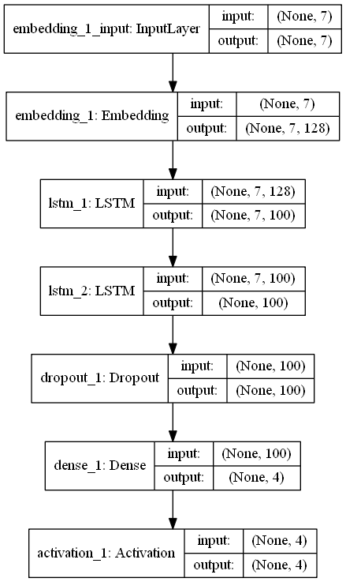
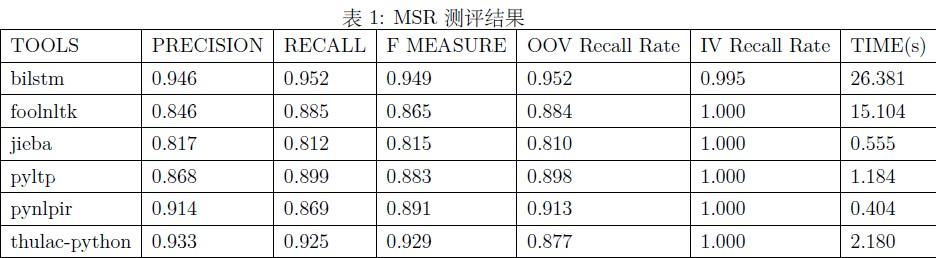
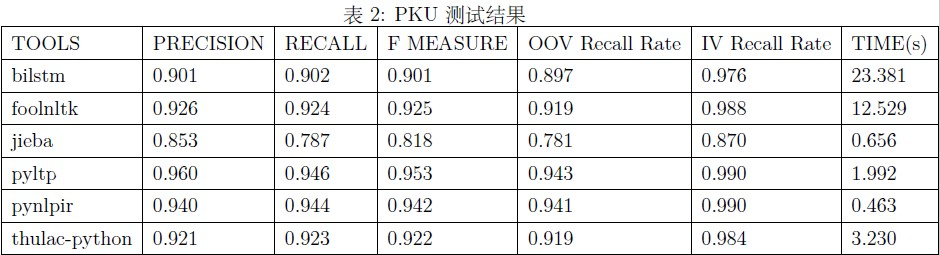

说明：
环境：python3 + python2
利用rnn实现中文分词算法
源码参考: http://www.jianshu.com/p/7e233ef57cb6

训练步骤：

1. 用现有的语料库（已经切分好）训练出word2vec的model。 该步骤可省略，词向量模型做Embedding层初始化对结果影响不大。

   python ./train_word2vec_model.py ../dataset/msr_training.utf8 ./msr_training_w2v.model ./msr_training_w2v.vector  

   > 参数： 输入语料 输出的w2v模型文件  输出的词向量文件

2. 预训练处理语料库得到训练输入和测试输入 （注：由于py3中字符串不能编码 会报TypeError: can't concat str to bytes 这一步用py2环境执行）

   python ./pretrain.py ./dataset/msr_training.utf8 ./cws.info ./cws.data

   > 参数：输入语料 输出的字典与索引文件 输出的概率矩阵文件

3. 构建rnn并进行训练，在训练的同时测试准确率

   python ./train_keras_model.py ./cws.info ./cws.data ./cws_keras_model.json ./keras_model.weights 20个epoch即可稳定，验证集acc为97.8%

4. 根据训练好的model得到可能的序列组合，并利用viterbi算法选择出其中可能性最大的一个序列

   python ./test_keras_model.py ./cws.info ./cws_keras_model.json ./keras_model.weights ./dataset/msr_test.utf8 ./dataset/cws_result.txt

   > 参数： info文件 json格式的keras模型文件 训练好的keras模型权重文件 测试集 输出的分词结果文件

模型结构如下：

- cepin.inpynb: 多种分词框架性能测评(thulac-python、jieba、pyltp、pynlpir、foolnltk)，bilstm表示本模型

- 分词测评数据以及测评脚本见http://sighan.cs.uchicago.edu/bakeoff2005/中的icwb2-data,使用了PKU与MSR两种语料。

- 测评方法，在得到各个分词工具生成的分词结果seg_result.txt之后
  '''perl
  ./score ../gold/pku_training_words.txt ../gold/pku_test_gold.txt seg_result.txt > score.txt
  '''

- 参数分布对应： 训练集 测试集黄金标准 分词结果文件 score为生成的得分文件

- 我的测试结果如下：

  

  

  

